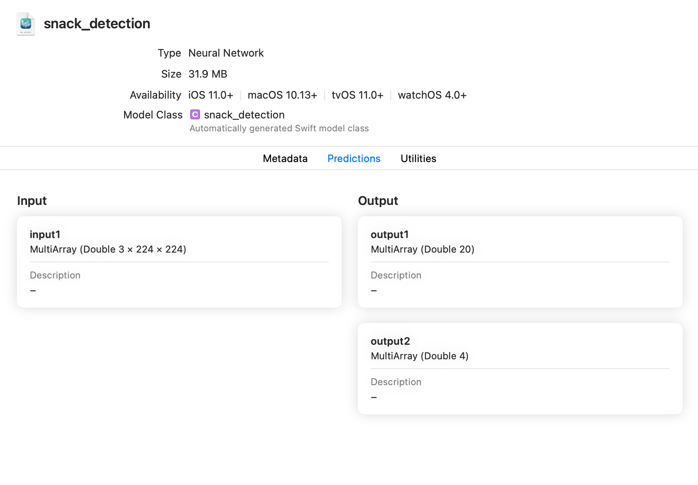

# 11月26日作业(时间两周) 

## 完成情况

阅读并重新运行了给定的Notebook, 导出了对应的mlmodel文件.

## 作业要求
- 独立阅读并运行给定的Jupyter Notebook，只需要运行，不需要修改任何代码
- 当你运行结束后，会得到一个mlmodel模型文件。如果你在运行Notebook时阅读了代码，那么你对这个模型文件的功能已经有了足够了解。
这个模型文件在预测输入图片中零食类别的同时，给出了还给出了一个矩形范围，用来标识零食在图片中出现的位置。


它的输出是一个长度20的array和一个长度为4的array。长度20的array的第i项给出了图片中零食属于第i个类的概率，长度为4的array给出了零食位置。具体可以参考notebook。

- 获得模型文件之后，开发一个可以检测图片中零食种类和位置的ios app。可以是拍照检测，也可以是实时检测，但是都需要在原图片中绘制出区域。可以参考[示例](https://github.com/hollance/YOLO-CoreML-MPSNNGraph)的实现。

## 注意事项
- 环境：建议使用macos或者linux，使用conda根据env.yaml来安装环境
- 如果你的linux机器没有gpu或者使用macos机器，请将tensorflow-gpu替换为tensorflow
``` shell
conda uninstall tensorflow-gpu
conda install tensorflow==1.14.0
```

- 如果不使用gpu，可能需要较长时间（几小时），请合理分配时间