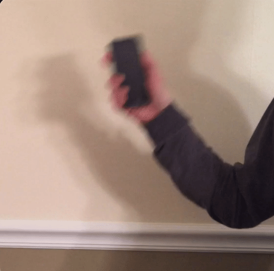
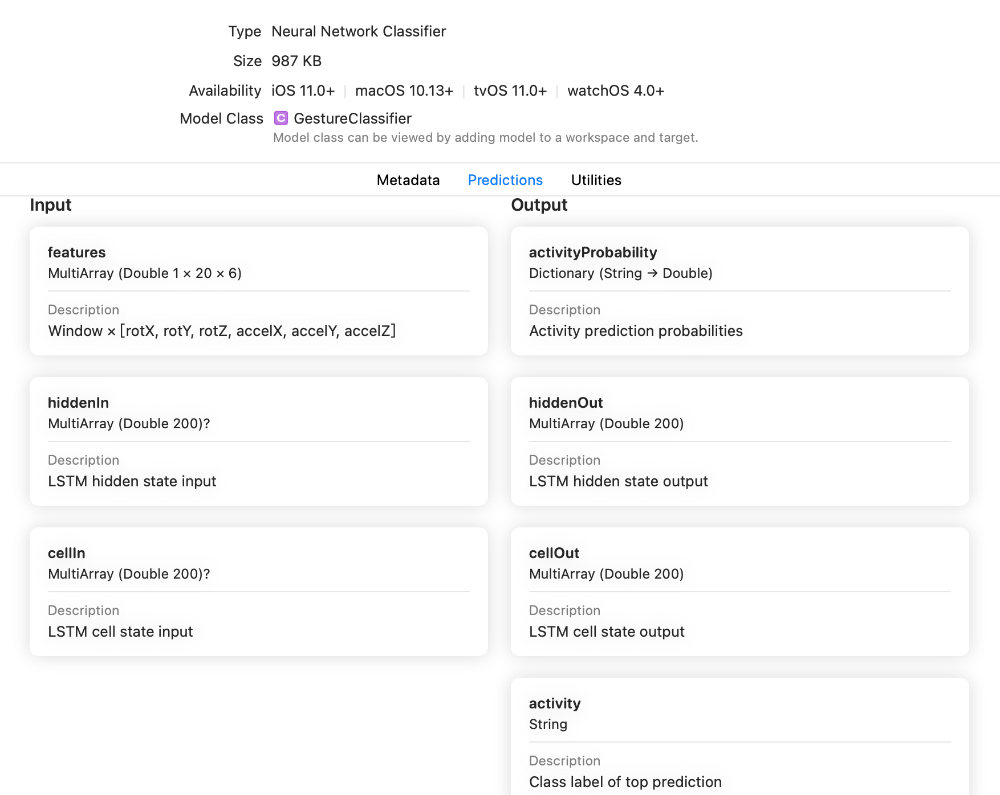

# 作业6: iOS 运动检测应用开发

## Preview

在之前的作业中，我们主要关注应用的输入为图片的场景。本次作业我们通过完成一个运动检测应用开发的流程来学习对序列数据进行分析、分类，以及开发相关的iOS智能应用。

在本次作业中，你需要开发一个应用，使用CoreMotion框架来采集设备的运动传感器的数据，通过CoreML的模型来预测设备的运动模式。输出的运动模式包括以下几种：

<table>
  <tr>
    <td></td>
    <td></td>
    <td></td>
  </tr>
  <tr>
    <td>chop</td>
    <td>drive</td>
    <td>shake</td>
  </tr>
</table>

除了三种运动模式外，你的模型也会输出静止状态(rest)。

本次作业使用的Python环境为[turi-env.yaml](./turi-env.yaml)。

## Part 1: 数据收集&数据清洗

1. CoreMotion

   > Core Motion可以从从iOS设备上获取（包括加速度计，陀螺仪，计步器，磁力计和气压计）报告运动和环境相关数据。我们可以使用此框架访问设备生成的数据，以便在应用程序中使用它们。例如，游戏可能会使用加速度计和陀螺仪数据来控制屏幕上的游戏行为。

   本次作业中，我们会使用CoreMotion来收集模型的输入数据。

2. 数据收集

   我们已经提供了收集好的[数据](./1. data-collection/data)，如果你对如何使用CoreMotion收集训练数 据感兴趣，可以使用GestureRecorder应用来体会收集数据的过程。这些数据没有经过任何处理的原始数据，为了达到更好的训练效果，我们一般需要清洗数据。

3. 数据清洗

   我们提供了[notebook](./1. data-collection/Data_Exploration_Complete.ipynb)可以用于对数据进行清洗，运行notebook后，得到的数据将用于第二部分的模型训练。通过进行数据清洗，我们可以得到降低数据的噪声，去除缺失值、异常值等。

## Part 2: 使用TuriCreate训练模型

[TuriCreate](https://github.com/apple/turicreate)是苹果提供的用于简化在苹果设备上进行机器学习任务的工具，它提供了一些预训练的模型，使用者只需要提供少量的数据就可以通过迁移学习得到高性能模型。

将第一步得到的数据放入到指定的目录，并运行[notebook](),就可以使用TuriCreate进行训练，并得到CoreML模型。

## Part 3: 使用模型开发iOS手势检测应用

经过第二步的训练，我们会得到一个可以对序列数据进行预测的模型。

这个模型是一个[LSTM]()，它的特点是会将神经元的输出作为下一次的输入，因此在进行预测时，会考虑历史的数据，因此非常适用于类似于文本、信号等序列数据。

我们可以看到模型除了会输出预测的activaty以及概率，还会输出网络的hiddenOut和cellOut，这两部分可以作为网络的可选输入。因此你的App中，应该采集多个window的features，并将前一次预测的输出中的cellOut和hiddenOut连同下一个feature一起输入到模型中。从多次预测结果中选取概率最大的。